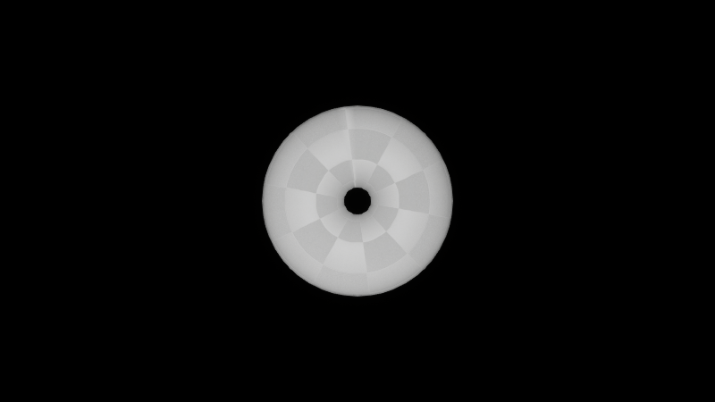
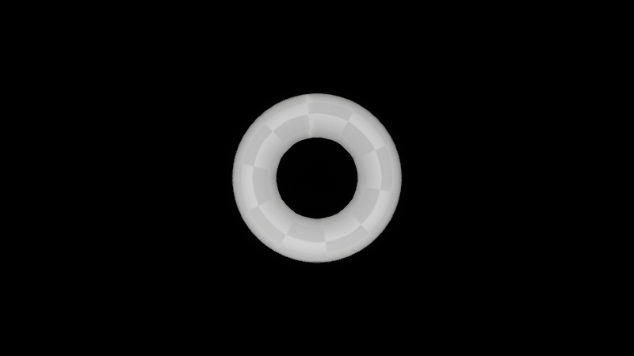
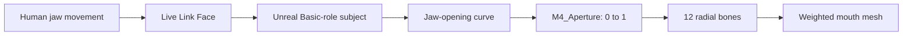

# MorphoRelay

### Human-to-Creature Performance Transfer

**Planet Animora · Research prototype · M4 radial-mouth experiment**

**Developed at Innowaft for Planet Animora.** Proof-of-concept authors: [Nelli James](https://id.innowaft.com/e006) and [SugamOviyam](https://id.innowaft.com/e019), working at Innowaft.

A human opens their jaw. A creature opens a radial mouth. MorphoRelay explores the control representation between these two movements: a small, interpretable set of performance signals that can drive an anatomy with a different structure.

[Demo GIF](docs/setup/images/Step%20X%20-%20Should%20ideally%20Workk.gif) · [Illustrated setup](docs/setup/README.md) · [Technical note](docs/research.md) · [Reproduce the assets](docs/reproduction.md)

| Minimum aperture · 0.0 | Maximum aperture · 1.0 |
|:--:|:--:|
|  |  |

*Unreal renders from the initial actuator validation. These are controlled endpoint poses; the linked GIF shows the live proof of concept.*

## Abstract

Performance capture becomes ambiguous when a target creature lacks the performer's facial structure. This prototype tests a direct control mapping from a human jaw-opening signal to a radial aperture. Live Link Face supplies a solved facial curve to Unreal Engine; a C++ adapter clamps the signal into a normalized actuator value and moves twelve radial bones. Procedural skin weights concentrate movement near the opening while anchoring the outer rim. The initial experiment demonstrates interactive control on one mesh and validates a monotonic aperture response. It provides a reproducible baseline for investigating how performance intent can be expressed across different creature anatomies.

## Research question

A radial mouth has no human jaw hinge or corresponding lip layout. A useful transfer therefore needs an explicit decision about what to preserve. In this experiment that quantity is **opening**, represented by one scalar. The target rig determines how opening becomes geometry.

The research question is: **How much of a performance can a compact control representation preserve when source and target anatomies differ?** M4 addresses the first, narrow case: one input, one actuator, one target.

## Creature families: M1–M6

M1–M6 are Planet Animora's identifiers for creature anatomy families. Each family is intended to have its own adapter that translates shared performance signals into suitable rig controls. The numbering identifies families; it does not indicate development stages or maturity.

| Family | Anatomy | Status in this repository |
|---|---|---|
| M1 | Reserved; anatomy to be defined | No implementation |
| M2 | Reserved; anatomy to be defined | No implementation |
| M3 | Tentacle mouth | Proposed spread, curl, compression, and mouth-gap controls |
| M4 | Radial / circular mouth | Implemented aperture actuator and live jaw input |
| M5 | Beak | Proposed opening, closure strength, and upper/lower beak controls |
| M6 | Feline / cat / lion-like mouth | Proposed jaw, muzzle, lip-corner, and snarl controls |

M4 is the first experiment because a radial mouth exposes a clear, compact actuator: aperture. The other families describe the research roadmap; their rigs and transfer behavior are still to be developed.

## From performance to aperture



For an incoming value $j$, the actuator uses $a=\mathrm{clamp}(j,0,1)$. Bone offsets from the mouth center are multiplied by $s(a)=0.65+0.70a$. The bones translate radially; the mesh's outer attachment remains nearly stationary because its weights favor the center bone.

The implementation uses `UPoseableMeshComponent`. It includes manual aperture control, a sine-wave demonstration mode, and a Live Link mode with a readable status field. The adapter looks for `jawOpen`, with support for a namespaced curve ending in `jawOpen` when that default lookup fails.

## Prototype results

| Observation | Evidence and scope |
|---|---|
| Phone drives aperture in Play | Confirmed by the project operator during development; demo GIF included |
| Aperture responds monotonically | Five actuator samples checked; analytical deformation checked at 0, 0.5, and 1 |
| Normalized weights | 1,536 vertices validated, with no more than three influences each |
| Stable outer attachment | Mean outer-band displacement below 0.0003 cm in the analytical endpoint calculation |
| Build environment | Windows, Unreal Engine 5.8.3, MSVC 14.50, Windows SDK 10.0.22621.0 |

The numerical measurements are from the initial asset validation, preserved in [the evidence extract](docs/evidence/initial-validation.txt). Regeneration from the Blender export passed the same checks with matching results to the shown precision; see [the re-import validation](docs/evidence/blender-reimport-validation.txt). Live interaction has been demonstrated; latency, tracking error, user performance, and behavior across different creature meshes remain unmeasured. The minimum aperture intentionally retains a hole.

## Build and run

1. Install **Unreal Engine 5.8.3**. Install **Visual Studio 2026** with **Game development with C++**, MSVC C++ tools, and a Windows 10/11 SDK. VS 2022 **17.14+** is also supported by UE 5.8; see [Epic's setup table](https://dev.epicgames.com/documentation/en-us/unreal-engine/setting-up-visual-studio-development-environment-for-cplusplus-projects-in-unreal-engine).
2. Right-click `PerfBridgeMH/PerfBridgeMH.uproject` → **Generate Visual Studio project files**. Open the generated solution, select **Development Editor | Win64**, and build `PerfBridgeMH`.
3. Open the project and `Content/PlanetAnimora/POC/M4/MAP_M4_RadialMouth_POC`.
4. Follow the [illustrated setup](docs/setup/README.md). Set the phone to **MetaHuman Animator**, enable **Realtime Animation**, and connect a Live Link Face source named `M4_iPhone`.
5. Before Play, select the mouth actor, enable **Use Live Link**, select that subject, disable **Auto Oscillate**, and **save the level**. During Play, **Live Link Status** should show a changing curve value.

Generated solutions, binaries, caches, and local editor state are excluded. Unreal regenerates them locally. Blender is needed only to edit or re-export the source mesh; `Mouth.blend` and the portable `Mouth.fbx` are included in `assets/mouth/`.

## Open research questions

The original aim is to reuse MetaHuman performance signals on custom creature meshes. We see the radial-mouth prototype as a stepping stone toward beak articulation, expressive tentacle motion, and other anatomy-specific controls. A future offline adapter would derive those controls from animation curves associated with a solved MetaHuman Performance Asset. The current implementation uses live jaw input; the offline path, additional creature adapters, and emotional readability remain research goals.

- **Control representations:** compare a direct scalar mapping with calibrated, nonlinear, and multi-signal mappings.
- **Different anatomies:** test segmented jaws, asymmetric mouths, and tentacles; measure the amount of rig-specific work required.
- **Temporal behavior:** measure capture-to-display delay, jitter, dropout recovery, and the cost of smoothing.
- **Perceptual evaluation:** test whether viewers recognize intended actions and whether performers can reliably reach target poses.
- **Authoring tools:** expose constraints and response curves so artists can tune a creature's behavior without changing C++.

The contribution at this stage is a documented implementation and an experimental starting point. Novelty and comparative performance require a broader literature review and controlled evaluation. [The technical note](docs/research.md) defines those next experiments.

## Repository

```text
assets/mouth/       Blender source and portable FBX
PerfBridgeMH/       Unreal C++ project, content, and editor scripts
docs/
  setup/           Illustrated Live Link guide, screenshots, and demo GIF
  figures/         Aperture comparison renders
  evidence/        Validation reports
  research.md      Method and research scope
  reproduction.md  Build and asset regeneration
tools/             Blender preparation script
```

## Related work

Motion retargeting and deformation transfer have a substantial research history. Gleicher's [Retargetting Motion to New Characters (1998)](https://graphics.cs.wisc.edu/Papers/1998/Gle98/retarget-preprint.pdf) considers adapting motion under character constraints. Sumner and Popović's [Deformation Transfer for Triangle Meshes (2004)](https://people.csail.mit.edu/sumner/research/deftransfer/) transfers surface transformations through correspondences. MorphoRelay currently uses an explicitly chosen scalar actuator rather than a general geometric transfer solver. Capture and streaming use Epic's existing [Live Link Face source](https://dev.epicgames.com/documentation/en-us/metahuman/using-a-live-link-face-source).

## License and contributions

MorphoRelay is freely available under the [MIT License](LICENSE). You are welcome to use it in your own projects, adapt the implementation, and build on the ideas, including for commercial work, while retaining the license and copyright notice.

We encourage contributions that advance performance transfer across different creature anatomies: new control mappings, rigs, experiments, benchmarks, and improvements to the tools or documentation. Share what you build and help expand the research in this space.

Unreal Engine and third-party plugins remain subject to their own licenses.
