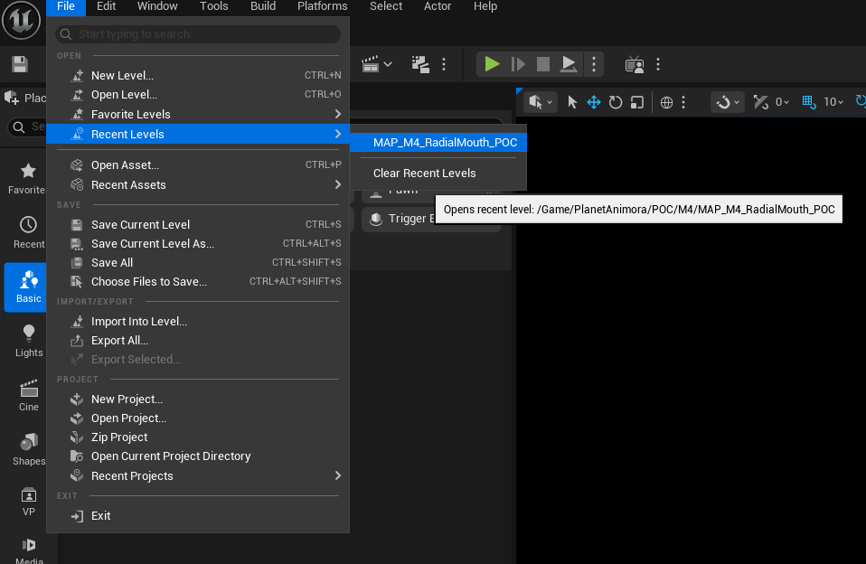
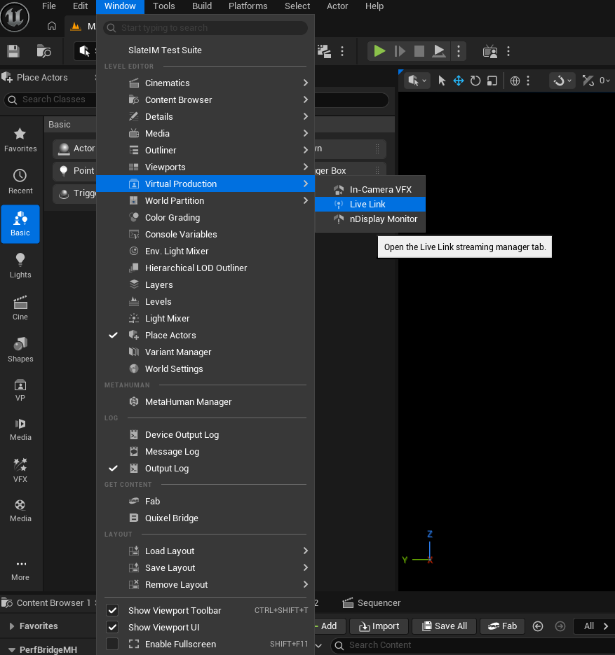
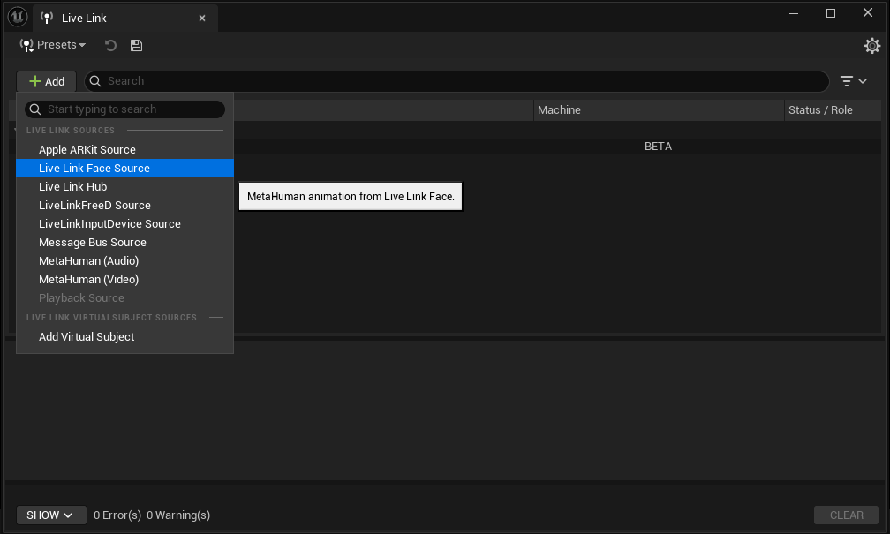
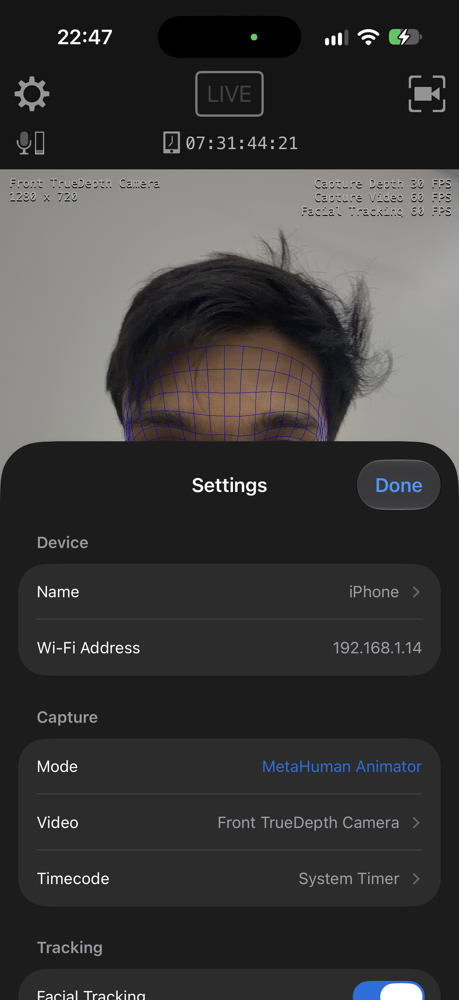
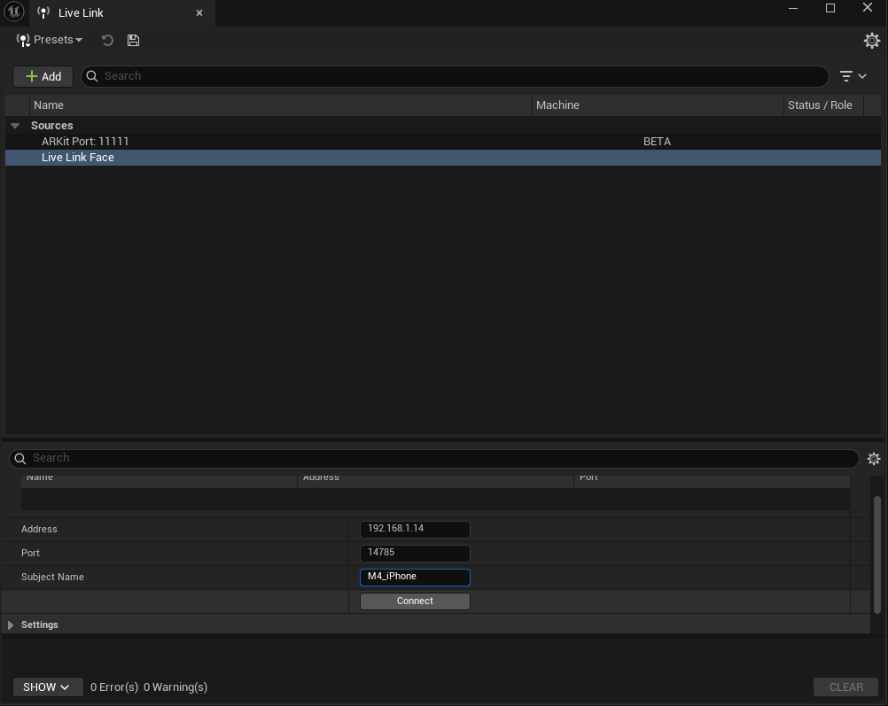
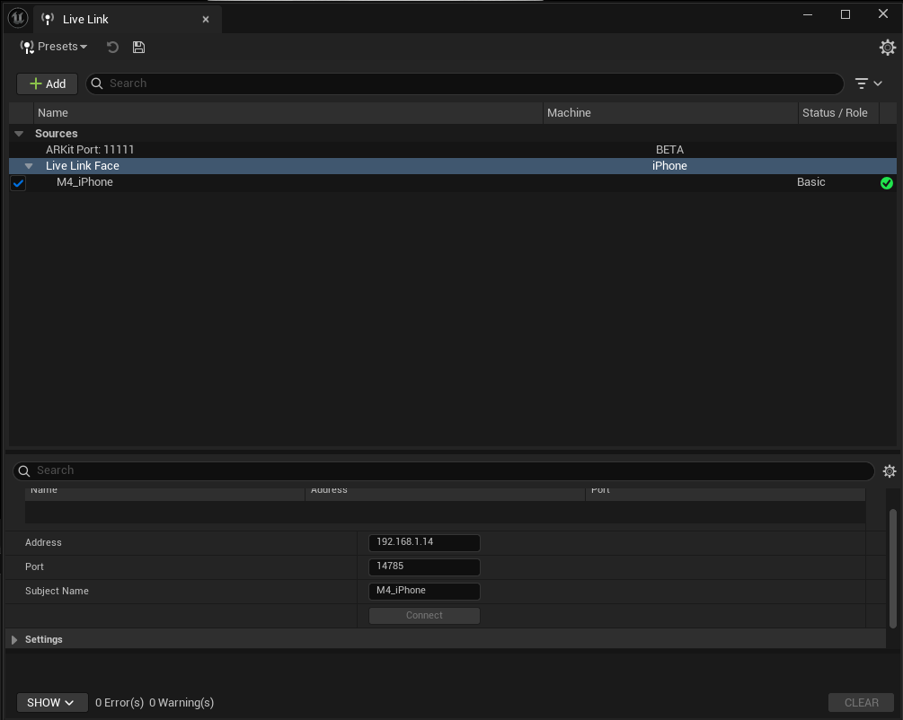
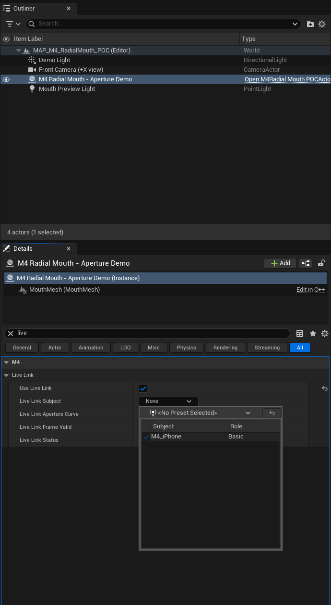
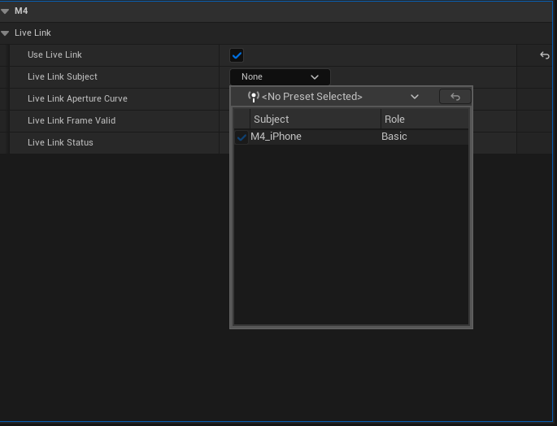
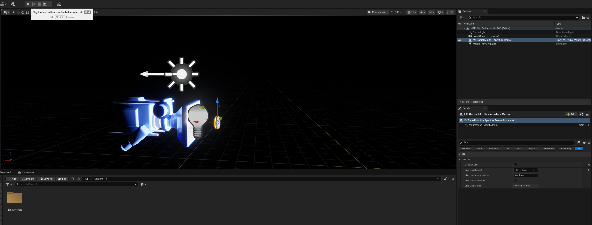

# Live Link setup after building

Build with Unreal Engine **5.8.3**, then follow these steps. Addresses in the screenshots belong to the original test session; use your phone's current address.

1. Open `MAP_M4_RadialMouth_POC`.

   

2. Open **Window → Virtual Production → Live Link**.

   

3. Add a **Live Link Face** source.

   

4. Keep Live Link Face open on a phone connected to the same network. Choose **MetaHuman Animator** capture mode and enable **Realtime Animation**.

   

5. Enter the phone address, port **14785**, and subject name **M4_iPhone**.

   

6. Connect and confirm a green subject indicator.

   

7. Select the mouth actor in the Outliner. Enable **Use Live Link** and disable **Auto Oscillate**.

   

8. Select **M4_iPhone** as the actor's Live Link Subject. Save the level **before Play**.

   

9. Press Play and open/close your jaw. The center opening should expand/contract. **Live Link Status** on the Play actor shows the matched curve and value.

   

### Expected result

